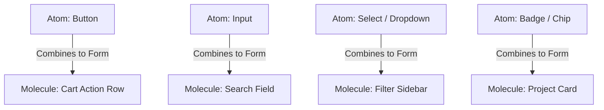
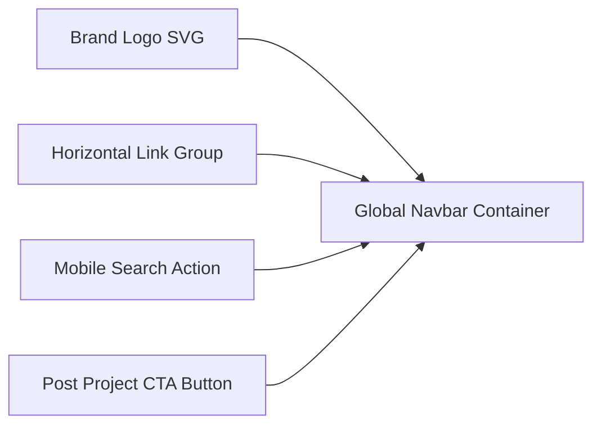

# Component Inventory - InnovateGuide IT Project Marketplace

This document cataloges the full library of reusable React components, detailing their props interfaces, state structures, CSS class mappings, and accessibility profiles.

---

## 1. Atom Components (Primitives)

These are the smallest functional elements, built for configuration and consistency.



### A. Button (`Button.jsx`)
*   **Props Interface**:
    ```typescript
    interface ButtonProps {
      variant: 'primary' | 'secondary' | 'accent' | 'text';
      size: 'sm' | 'md' | 'lg';
      icon?: string; // Material symbol icon name
      isLoading?: boolean;
      disabled?: boolean;
      onClick: (event: React.MouseEvent<HTMLButtonElement>) => void;
      children: React.ReactNode;
      className?: string;
    }
    ```
*   **Visual Mappings**:
    *   *Primary*: `bg-primary text-white hover:bg-primary-container shadow-sm border border-transparent`
    *   *Accent*: `bg-secondary text-white hover:bg-secondary-container shadow-md border border-transparent`
    *   *Secondary*: `bg-transparent text-primary border-2 border-primary hover:bg-primary/5`
    *   *Dimensions*: `rounded-lg` (8px radius) across all variants.
*   **Accessibility**: Implements `aria-busy` when loading and standard keyboard controls.

### B. Form Input (`Input.jsx`)
*   **Props Interface**:
    ```typescript
    interface InputProps {
      type: 'text' | 'email' | 'number' | 'password';
      placeholder: string;
      value: string | number;
      onChange: (value: string) => void;
      error?: string;
      label?: string;
      iconLeft?: string;
    }
    ```
*   **Visual Mappings**:
    *   *Container*: `rounded-xl` (16px radius), `border-2 border-outline-variant bg-surface-container-lowest`
    *   *Interaction*: Focus changes border to `border-primary` with a light shadow glow.
*   **Validation States**: Displays label, red-error border overlay, and sub-text error description when validation fails.

---

## 2. Molecule Components (Composites)

Molecules group atoms to handle specific visual layouts or data actions.

### A. Project Template Card (`ProjectCard.jsx`)

The default project listing component used in grid arrays.

*   **Props Interface**:
    ```typescript
    interface ProjectCardProps {
      id: string;
      title: string;
      price: number;
      rating: number;
      reviewsCount: number;
      imageUrl: string;
      category: string;
      techStack: string[];
      onViewDetails: (id: string) => void;
      onAddToCart: (id: string) => void;
    }
    ```
*   **Visual Structure**:
    *   *Outer Card Shell*: `bg-white rounded-xl shadow-[0px_4px_20px_rgba(27,85,115,0.05)] p-4 flex flex-col gap-3 hover:translate-y-[-2px] hover:shadow-[0px_12px_32px_rgba(27,85,115,0.12)] transition-all duration-300`
    *   *Thumbnail Image*: Ratio `16:9` with `rounded-lg` wrapper and hover-scale effect.
    *   *Price / Buy Section*: Lower card panel showing price highlighted in `text-on-surface` and primary "Buy Now" button.
*   **Tech Stack Tags**: Rendered inside the card as horizontal badges (`bg-primary/10 text-primary rounded-full px-2 py-0.5 text-xs`).

### B. Category Card (`CategoryCard.jsx`)

Circular/Square navigation chip representing broad market groups.

*   **Props Interface**:
    ```typescript
    interface CategoryCardProps {
      id: string;
      label: string;
      iconName: string; // Material symbols name
      projectsCount: number;
      isActive: boolean;
      onClick: (id: string) => void;
    }
    ```
*   **Visual Mappings**:
    *   *Container*: `flex flex-col items-center justify-center p-6 rounded-xl border border-outline-variant/30 bg-white cursor-pointer`
    *   *Active State*: Highlights container border with `border-primary` and scales background color tone to `bg-surface-container`.

---

## 3. Organism Components (Complex Layout Blocks)

Organisms manage page hierarchies and main layout containers.

### A. Global Layout Navbar Header (`Navbar.jsx`)



*   **Behavior**:
    *   Sticky header (`sticky top-0 z-50 bg-white/90 backdrop-blur-md border-b border-outline-variant/20`).
    *   Responsive menu toggle for tablets and mobile devices.
*   **Active Link Highlighting**: Synchronized with active route states using color transformations (`text-primary font-semibold`).

### B. Global Layout Footer (`Footer.jsx`)
*   **Behavior**: Renders 4 columns of information alongside social media links and newsletter email inputs.
*   **Visual Structure**: Dark surface canvas (`bg-inverse-surface text-inverse-on-surface py-12 px-margin-desktop`).

### C. Multi-Step Stepper Wizard (`StepperForm.jsx`)
*   **Props Interface**:
    ```typescript
    interface StepperFormProps {
      steps: string[];
      activeStepIndex: number;
      onStepClick?: (index: number) => void;
      children: React.ReactNode;
    }
    ```
*   **Visual Structure**:
    *   *Header Bar*: Horizontal stepper track. Circles display indices (`1`, `2`, `3`) or completion checkmarks (`check` symbol).
    *   *Form Window*: Animates step switches horizontally using CSS transitions.
*   **Button Actions**: Navigation block at the bottom displaying a "Back" button (secondary variant) and "Next / Submit" button (accent variant).
