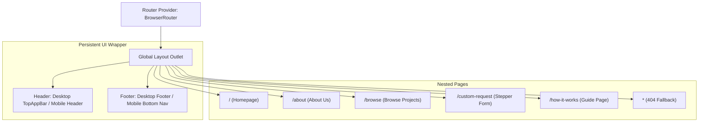

# Routing Plan - InnovateGuide IT Project Marketplace

This document defines the client-side routing structure, nested route layouts, URL state synchronization patterns, and page lazy-loading strategies for the **InnovateGuide IT Project Marketplace**.

---

## 1. Route Definitions & Layout Wrappers

The routing system is built using **React Router v6** declarative routing. The entire application is nested within a global wrapper layout to maintain persistent elements (e.g. Header Navigation, Footer, Mobile bottom navigation dock).



### Route Map Specification

| Route Path | Page Component | Layout Shell | Auth Required | Description |
| :--- | :--- | :--- | :---: | :--- |
| `/` | `Homepage.jsx` | Global Layout Shell | No | Marketing landing page with hero banner, category grid, trending projects carousel, and client stats. |
| `/about` | `AboutUs.jsx` | Global Layout Shell | No | Mission statement, team bios, value proposition, and client testimonial grids. |
| `/browse` | `BrowseProjects.jsx` | Global Layout Shell | No | Catalog page with interactive sidebar filters, search field, sorting tags, and project card grid. |
| `/custom-request`| `CustomRequest.jsx` | Global Layout Shell | No | Stepper wizard form to request custom work from IT developers. |
| `/how-it-works` | `HowItWorks.jsx` | Global Layout Shell | No | Educational guide detailing the project buying, listing, and validation workflow. |
| `*` | `NotFound.jsx` | Global Layout Shell | No | Fallback 404 page returning users back to home paths. |

---

## 2. URL State Mapping & Synchronization

To enable deep-linking and back-button navigation, filter states on the `/browse` page are synchronized directly with the URL query parameters.

### Filter Parameters Mapping

| State Variable | URL Query Key | Expected Data Type | Example Value | Filter Action |
| :--- | :--- | :--- | :--- | :--- |
| **Search String** | `q` | `string` | `q=react+ecommerce` | Triggers title/description substring keyword matches. |
| **Active Category** | `category` | `string` (Slugified) | `category=mobile-apps` | Filters projects by the selected category group. |
| **Sorting Preference**| `sort` | `trending` \| `price-asc` \| `price-desc` | `sort=price-asc` | Orders card listings on screen in ascending or descending price order. |
| **Min Budget Limit** | `budgetMin` | `number` | `budgetMin=150` | Filters projects having values greater than or equal to budgetMin. |
| **Max Budget Limit** | `budgetMax` | `number` | `budgetMax=1200` | Filters projects having values less than or equal to budgetMax. |

---

## 3. Lazy Loading & Suspense Configuration

To achieve optimal performance and low bundle sizes, all page-level components are code-split and loaded asynchronously using React's `lazy` and `Suspense` helpers.

### Code Splitting Architecture Example

```javascript
// App.jsx
import React, { lazy, Suspense } from 'react';
import { BrowserRouter, Routes, Route } from 'react-router-dom';
import GlobalLayout from './layouts/GlobalLayout';
import PageLoader from './components/PageLoader'; // Skeleton indicator

// Lazy Load Pages
const Homepage = lazy(() => import('./pages/Homepage'));
const AboutUs = lazy(() => import('./pages/AboutUs'));
const BrowseProjects = lazy(() => import('./pages/BrowseProjects'));
const CustomRequest = lazy(() => import('./pages/CustomRequest'));
const HowItWorks = lazy(() => import('./pages/HowItWorks'));
const NotFound = lazy(() => import('./pages/NotFound'));

export default function App() {
  return (
    <BrowserRouter>
      <Suspense fallback={<PageLoader />}>
        <Routes>
          <Route path="/" element={<GlobalLayout />}>
            <Route index element={<Homepage />} />
            <Route path="about" element={<AboutUs />} />
            <Route path="browse" element={<BrowseProjects />} />
            <Route path="custom-request" element={<CustomRequest />} />
            <Route path="how-it-works" element={<HowItWorks />} />
            <Route path="*" element={<NotFound />} />
          </Route>
        </Routes>
      </Suspense>
    </BrowserRouter>
  );
}
```
