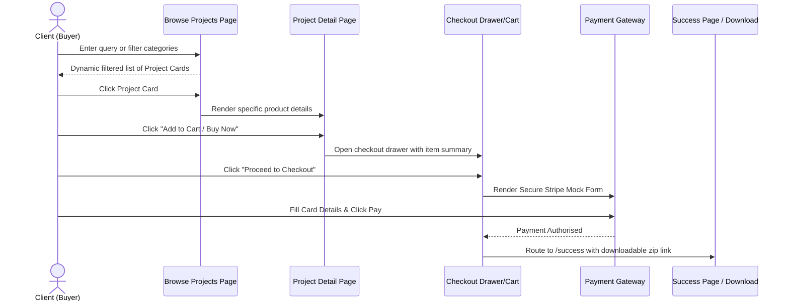
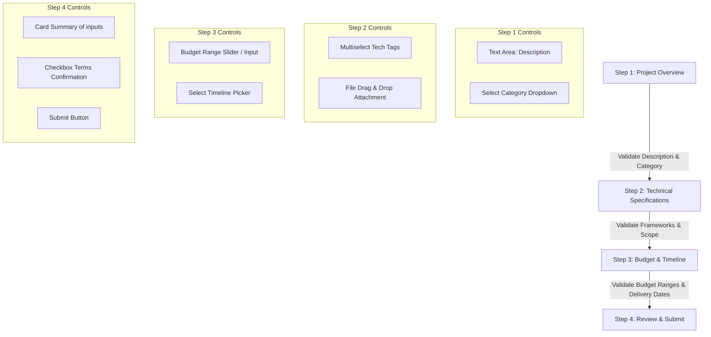
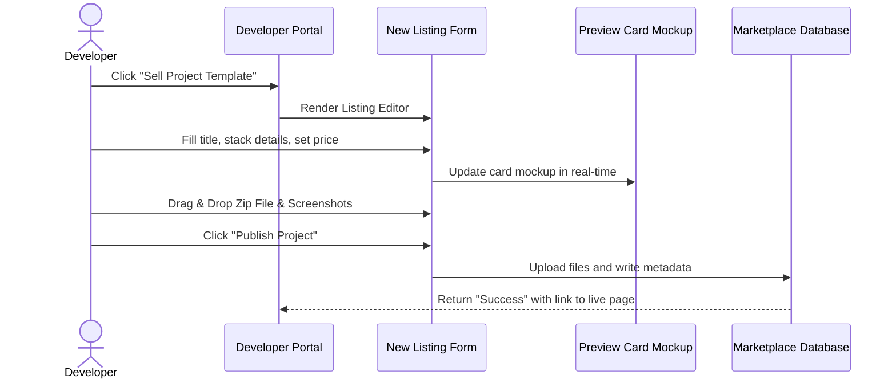

# User Flows Specification - InnovateGuide IT Project Marketplace

This document details user personas, core interaction flows, step-by-step wizard forms, checkout processes, and error validation states for the **InnovateGuide IT Project Marketplace**.

---

## 1. User Personas & Target Audiences

To validate navigation design decisions, two core customer personas are supported:

### A. The Project Buyer / Client (SME Owner, Project Manager)
*   **Need**: Discovering and purchasing production-ready templates, source code bases, or hiring developers for custom enhancements.
*   **Key Path**: Search → Filter by Stack → Inspect Product Page → Complete Checkout → Download Source Code. Or alternatively: Submit a Custom Project Request.

### B. The Project Seller / Developer (Freelancer, Tech Shop)
*   **Need**: Publishing pre-built software project templates to generate passive income.
*   **Key Path**: Upload Assets → Set Price & Tags → Publish Listing → Monitor Sales Performance Dashboard.

---

## 2. Core User Journeys

Here we blueprint the key interactive paths through sequence flows and steps.

### Journey 1: Discovery-to-Purchase Flow (Project Template Checkout)

This flow tracks a buyer searching for, selecting, and purchasing a pre-built project template.

---

### Journey 2: Multi-step Custom Project Request Flow

A cornerstone feature of InnovateGuide is the multi-step request wizard. The stepper must hold local field validation and update progress indicators dynamically.

#### Detailed Stepper Form Validation Rules

| Stepper Phase | Form Fields | Validation Rules | Error Recovery State |
| :--- | :--- | :--- | :--- |
| **1. Overview** | Title, Description, Core Category | Title length must be `>= 10` characters. Description must be `>= 50` characters. Category select is required. | Fields show red outline border with message: "Please detail your requirements to obtain accurate developer quotes." |
| **2. Tech Specs** | Frameworks, Target Platform, Scope document (Optional File) | Select at least `1` technology tag. Optional files must be `< 10MB` in PDF, DOCX, or ZIP. | Dynamic warning label shows: "Selecting specific stacks increases response rate by 40%." |
| **3. Budget & Timeline**| Target budget range, expected delivery date | Budget must be a positive number. Timeline date must be at least `7 days` in the future. | Soft validation warning triggers if budget is below `$100` for complex projects. |
| **4. Final Review** | Edit triggers for all fields, Terms acceptance check | Review and confirm terms check constraint. | Clicking "Submit" triggers full form submit animation. |

---

### Journey 3: Developer Project Listing Flow

This flow covers how a developer publishes a project template.

---

## 3. Interactive States & Edge Cases

All paths throughout the site must handle the following UI visual states:

### A. Loading / Transition States
*   **Component Skeleton Loaders**: Standard gray pulse blocks match card container roundness metrics (`rounded-xl` or `16px`) to reduce layout shift during asynchronous fetches.
*   **Button Loading Toggles**: Clicking action buttons changes label text to a spinner animation and disables further clicks.

### B. Success & Confirmation Modals
*   **Checkout Completion**: Renders a glass-morphic modal displaying a visual transaction ID, invoice print button, and a prominent call-to-action button to download the purchased zip file.
*   **Custom Request Success**: Displays a clean stepper completion indicator alongside animated checkmark feedback.

### C. Error States & Fallbacks
*   **API Network Timeout**: Renders an alert box at the top of the card grids with a "Retry Connection" action button.
*   **Route Not Found (404)**: Renders a friendly "Project Lost in Orbit" page with returning navigation paths.
