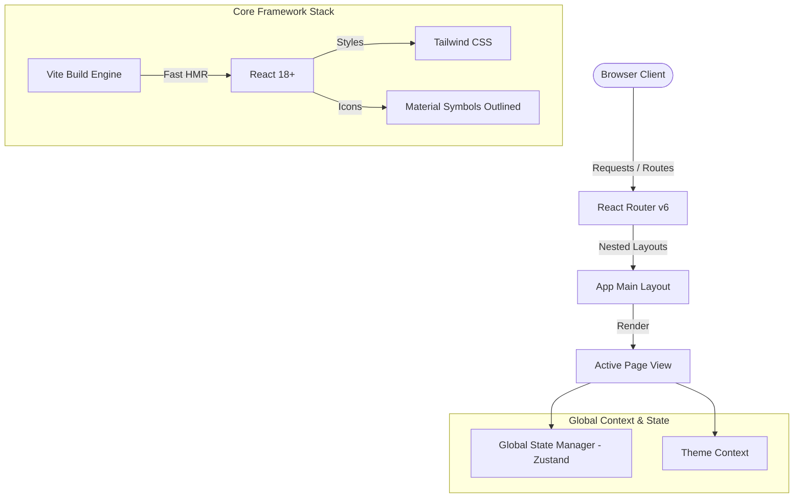
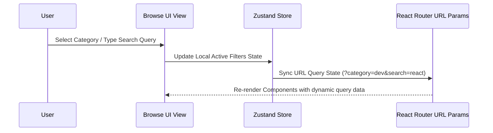

# Website Architecture Specification - InnovateGuide IT Project Marketplace

This document defines the architectural guidelines, responsive layout grid, styling standards, global state management, and visual systems for the **InnovateGuide IT Project Marketplace** frontend implementation.

---

## 1. System Context & Tech Stack Overview

The front-end of the InnovateGuide IT Project Marketplace is architected as a high-fidelity Single Page Application (SPA) utilizing **React**, **Vite** for rapid bundling, and **React Router v6** for nested layouts and path synchronization.

### Core Tech Stack
*   **Framework**: React (v18.2+) using functional components and hooks.
*   **Build Tool**: Vite (configured for ESM build targets and lightning-fast HMR).
*   **Styling Engine**: Tailwind CSS (via local config with specific custom color variables mapping to the Stitch design system).
*   **Icons**: Material Symbols Outlined (loaded via Google Web Fonts API).
*   **Typography**: Plus Jakarta Sans (loaded via Google Web Fonts API).

---

## 2. Responsive Breakpoints & Layout Grid

To maintain high visual fidelity across all target devices, the application implements a fluid-grid container layout using three main breakpoints:

| Viewport Category | Breakpoint Range | Columns | Grid Gutters | Side Margins | Max-Width Container |
| :--- | :--- | :---: | :---: | :---: | :--- |
| **Mobile** | `< 768px` | 4 | `16px` | `16px` | `100%` (Fluid) |
| **Tablet** | `768px` to `1024px` | 8 | `20px` | `24px` | `100%` (Fluid) |
| **Desktop** | `>= 1024px` | 12 | `24px` | `40px` | `1280px` (Max Grid Width) |

---

## 3. Desktop vs. Mobile Layout Containers

To ensure a premium user experience on mobile viewports without sacrificing content density, the layout container structures differ dynamically:

```mermaid
graph TD
    subgraph Desktop Viewport Layout
        D_Nav[Sticky Desktop Top Navigation Header]
        D_Main[Main Container Max Width: 1280px]
        D_Grid[12-Column Responsive Card Grid]
        D_Footer[Full Detailed Desktop Footer]
        
        D_Nav --> D_Main
        D_Main --> D_Grid
        D_Grid --> D_Footer
    end

    subgraph Mobile Viewport Layout
        M_Header[Simplified Mobile Header with Logo & Action Icon]
        M_Main[Fluid Container Side Margin: 16px]
        M_Scroll[Horizontal Scrollable Category List / Single Card Stack]
        M_BottomNav[Sticky Mobile Bottom Navigation Dock]
        
        M_Header --> M_Main
        M_Main --> M_Scroll
        M_Scroll --> M_BottomNav
    end
```

### Layout Comparison Matrix

| Component Area | Desktop Design Implementation | Mobile Design Implementation |
| :--- | :--- | :--- |
| **Header / Navigation** | Sticky TopAppBar featuring horizontal desktop link navigation, profile avatar dropdown, and a secondary styled "Post Custom Project" primary action button. | Slimmed header displaying the SVG logo brand assets on the left, search action icon, and notification bell on the right. |
| **Active Nav Control** | Highlighted active routes using border-bottom overlays and subtle primary-colored hover text scaling. | Persistent fixed **Bottom Navigation Bar** with key navigation targets (Home, Browse, Post Request, About) using active icons and label markers. |
| **Footer** | 4-column structured grid (Company Info, Browse, Support, Legal) alongside visual newsletter subscription inline form. | Collapsible section items and nested contact anchors with minimized copyright row. |
| **Listings & Cards** | Multi-row card grids (3 or 4 columns) with ambient spacing. | Single-card vertical stacks combined with horizontal swipe carousels (e.g. for Category Chips and Featured Projects) with `no-scrollbar` styling. |

---

## 4. Typography & Spacing System

The typography scale utilizes **Plus Jakarta Sans** as the default geometric typeface, mapping headings to bold weights with compressed letter-spacing and long copy to regular weights with comfortable line-heights.

### Typography Scale (Fluid CSS Classes)
*   **Display Title (`display-lg`)**: `48px` font size | `56px` line-height | Bold (`700`) | `-0.02em` tracking (Desktop)
*   **Mobile Display (`display-lg-mobile`)**: `32px` font size | `40px` line-height | Bold (`700`) | `-0.02em` tracking
*   **Headline Large (`headline-lg`)**: `32px` font size | `40px` line-height | Bold (`700`)
*   **Headline Medium (`headline-md`)**: `24px` font size | `32px` line-height | Semi-Bold (`600`)
*   **Body Copy Large (`body-lg`)**: `18px` font size | `28px` line-height | Regular (`400`)
*   **Body Copy Medium (`body-md`)**: `16px` font size | `24px` line-height | Regular (`400`)
*   **Interaction Labels (`label-md`)**: `14px` font size | `20px` line-height | Semi-Bold (`600`)

### Spacing Scale System
All layout paddings, gaps, and margins are calculated using an **8px-based spacing scale** to maintain vertical rhythm consistency:
*   `8px` (base padding, chip spacing, internal label margin)
*   `16px` (mobile margin, grid item gaps, input padding)
*   `24px` (desktop gutter, standard card container padding)
*   `32px` (hero element gaps, section separators)
*   `48px` (sub-page section margins)
*   `64px` (large container section block margins)

---

## 5. Global State Management & Routing Synchronization

The application's state architecture relies on a lean global state manager (**Zustand**) coupled with URL parameters to keep the search, filters, navigation tabs, and multi-step forms in sync with browser history.

### State Management Separation
1.  **Cart / Checkout State**: Zustand store containing active items, custom project quote selections, and payment process variables.
2.  **Filter & Search State**: React Router query variables (e.g. `?category=dev&q=e-commerce&sort=trending`) to permit deep linking directly to user-filtered states.
3.  **UI Interactivity State**: Local React hooks (`useState`) for micro-interactions such as accordions, modal toggles, dropdown activations, and mobile header menus.

---

## 6. Visual Style Integration

All custom styled classes map variables back to the brand tokens specified in the Stitch design system.

### Core Visual Tokens
*   **Brand Primary**: `#003d58` (Deep corporate trust Navy)
*   **Brand Secondary (Accent)**: `#ad3300` (Energetic Red-Orange conversion button accent)
*   **Neutral Dark**: `#001e2d` (Used for text headers, subheadings, and bold copy)
*   **Background / Canvas**: `#f5faff` (Light blue gradient/surface wash)
*   **Surface Containers**: White (`#ffffff`) for elevated items, `#ddf1ff` for secondary blocks.

### Transition & Micro-Animations
To deliver a premium, fluid interface, all interactive elements (buttons, inputs, hover states) leverage standard animation profiles:
*   **Global Transition**: `all 0.3s cubic-bezier(0.4, 0, 0.2, 1)`
*   **Hover Behavior**: On card/button hover, translate upward (`translate-y-[-2px]`), darken color value by `10%`, and scale shadow depth:
    *   *Default shadow*: `shadow-[0px_4px_20px_rgba(27,85,115,0.05)]`
    *   *Hover shadow*: `shadow-[0px_12px_32px_rgba(27,85,115,0.12)]`
*   **Hero Grid Overlay**: A custom geometric radial vector dot background (`30px` grid sizes) is blended dynamically at `5%` opacity over background sheets to inject high-velocity technological detail.
